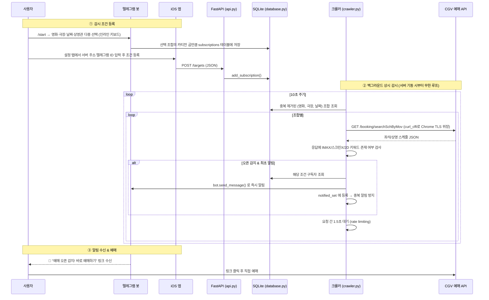

<div align="center">

# 🎬 CGV Watcher

### CGV 특별관(IMAX·ScreenX) 예매 오픈을 실시간으로 감지해 텔레그램 & iOS로 알려주는 자동화 시스템

당신이 자는 사이에도, CGV 대신 새로고침해 드립니다.


</div>

<br>

## 목차

- [1. 프로젝트 심층 소개](#1-프로젝트-심층-소개-overview)
- [2. 사용 기술 및 라이브러리](#2-사용-기술-및-라이브러리-tech-stack--dependencies)
- [3. 핵심 기능 및 상세 로직](#3-핵심-기능-및-상세-로직-key-features--logic)
- [4. 프로젝트 구조](#4-프로젝트-구조-및-파일-설명-directory-structure)
- [5. Getting Started](#5--getting-started-설치-및-실행-가이드)
- [6. Troubleshooting & Dev Log](#6-️-troubleshooting--dev-log)

<br>

## 1. 프로젝트 심층 소개 (Overview)

### 1-1. Why — 어떤 문제를 해결하는가

CGV의 인기 상영작, 특히 **IMAX·ScreenX 같은 특별관** 좌석은 상영 스케줄이 사전 공지 없이, 아주 불규칙한 타이밍에 오픈됩니다. 원하는 영화·극장·날짜·상영관 조합의 예매가 언제 열릴지 확인하려고 CGV 앱을 몇 분에 한 번씩 손으로 새로고침하는 건 명백히 비효율적입니다.

**CGV Watcher**는 이 "새로고침 노동"을 완전히 자동화합니다.

- 사용자는 텔레그램 봇 또는 iOS 앱으로 **"어떤 영화 / 어떤 극장 / 어떤 날짜 / 어떤 상영관"**을 감시할지 등록만 해두면 끝입니다.
- 백엔드가 등록된 모든 조건을 **10초 간격으로 자동 폴링**하며 CGV의 내부 예매 조회 API를 대신 확인합니다.
- 원하는 상영관의 좌석 스케줄이 처음 나타나는 순간(=오픈 감지) **텔레그램으로 즉시 알림**을 보냅니다.

CGV는 이 기능에 공식 API나 웹훅을 제공하지 않기 때문에, 실제 CGV 모바일 웹이 내부적으로 호출하는 비공식 API를 리버스 엔지니어링하여 재사용하는 방식으로 동작합니다.

### 1-2. 아키텍처 흐름 (Architecture Flow)



**설계 하이라이트**

| 포인트 | 설명 |
|---|---|
| 단일 프로세스, 3중 역할 | FastAPI 웹 서버 · 텔레그램 봇 폴링 · 크롤러가 **하나의 asyncio 이벤트 루프** 안에서 동시에 실행됨 |
| 요청 최적화 | 같은 (영화, 극장, 날짜) 조건은 상영관 타입이 달라도 **CGV API 호출을 1회로 묶어서** 처리 |
| 봇 차단 우회 | `curl_cffi`로 TLS/HTTP2 핑거프린트를 실제 크롬처럼 위장해 안정적으로 폴링 |
| 멀티 플랫폼 | 텔레그램 봇(주력)과 iOS 앱(보조) 모두 같은 SQLite를 공유하는 동일한 백엔드로 서비스 |

<br>

## 2. 사용 기술 및 라이브러리 (Tech Stack & Dependencies)

### Backend


| 라이브러리 | 역할 |
|---|---|
| **FastAPI** | iOS 앱이 통신하는 REST API(`/targets`) 서버 |
| **Uvicorn** | FastAPI를 8000번 포트에서 구동하는 ASGI 서버 |
| **Pydantic** | 요청 바디 스키마(`TargetRequest`) 정의 및 자동 검증 |
| **curl_cffi** | `AsyncSession(impersonate="chrome110")`으로 실제 크롬처럼 TLS 위장, CGV 봇 차단 우회 |
| **python-telegram-bot** | 인라인 키보드 기반 대화형 봇 UI 및 알림 발송 |
| **python-dotenv** | `.env` 파일에서 시크릿(봇 토큰)을 로드, 코드와 완전 분리 |
| **sqlite3** (표준 라이브러리) | 파일 기반 DB, 별도 서버 없이 구독 정보 영속화 |

### iOS App


| 기술 | 역할 |
|---|---|
| **SwiftUI** | 선언형 UI로 3-탭 구조(등록/목록/설정) 구현 |
| **URLSession + async/await** | FastAPI 서버와의 JSON 통신, 콜백 지옥 없는 비동기 처리 |
| **UserDefaults** | 서버 주소·텔레그램 ID를 코드가 아닌 **기기 로컬에** 안전하게 저장 |

### External APIs

| API | 용도 |
|---|---|
| **CGV 비공식 예매 조회 API** (`cgv.co.kr/api/v1/booking/searchSchByMov`) | 특정 극장·영화·날짜의 상영 스케줄 및 좌석 오픈 여부 조회 |
| **Telegram Bot API** | 대화형 조건 등록 UI 및 오픈 감지 시 실시간 알림 |

<br>

## 3. 핵심 기능 및 상세 로직 (Key Features & Logic)

### 🎛️ 텔레그램 다중 선택 위저드 (`telegram_bot.py`)

- `user_sessions`라는 인메모리 딕셔너리에 사용자별 진행 상태를 `{'movie': set(), 'theater': set(), ...}` 형태로 저장 — **카테고리별로 여러 항목을 동시에 다중 선택**할 수 있습니다.
- `build_keyboard()`가 선택된 항목에 `✅`를 붙여 인라인 키보드를 매번 다시 렌더링하고, 하나 이상 선택되면 "다음 단계로" 버튼을 노출합니다.
- 4단계(영화 → 극장 → 날짜 → 상영관) 선택이 끝나면 `itertools.product()`로 **모든 선택의 카티전 곱**을 계산해 한 번에 구독 등록합니다.
  - 예: 영화 2개 × 극장 1개 × 날짜 3개 × 타입 1개 선택 → **6개의 독립적인 감시 조건**이 저장됨.

### 🔍 백그라운드 크롤러 (`crawler.py`) — 프로젝트의 심장부

1. `AsyncSession(impersonate="chrome110")`으로 세션을 열어 TLS/JA3 핑거프린트를 크롬처럼 위장 → CGV의 봇 차단 로직 회피.
2. `(영화, 극장, 날짜)` 조합으로 **중복 제거 후 폴링** → 여러 사용자가 상영관 타입만 다르게 등록해도 API 호출은 조합당 1회.
3. 응답 JSON을 대문자 문자열로 정규화해 `"IMAX"` / `"스크린X"` / `"2D"` 부분 문자열 매칭으로 오픈 여부 판단.
4. `notified_set`(인메모리 집합)으로 **이미 알린 조합은 재알림하지 않음**.
5. 개별 API 요청 실패 시 `logging.warning()`으로 **어떤 조합이 왜 실패했는지 로그 기록** (초기엔 `except: pass`로 조용히 무시했지만, 디버깅을 위해 개선).
6. 요청 간 1.5초, 전체 사이클 간 10초 지연으로 CGV 서버에 부담을 주지 않도록 rate limiting.
7. `asyncio.CancelledError`를 명시적으로 처리해, 서버 종료 시 크롤러가 깔끔하게 종료됨.

### 🌐 REST API (`api.py`, `models.py`)

- `Pydantic`의 `TargetRequest`가 요청 바디 타입을 강제, 잘못된 요청은 자동 422 반환.
- `GET /targets` (전체 조회, 디버깅용) · `GET /targets/{user_id}` (개인별 조회) · `POST /targets` (등록) · `DELETE /targets` (삭제) — iOS 앱의 CRUD를 전부 지원.

### 💾 데이터 계층 (`database.py`)

- `UNIQUE(user_id, movie_code, theater_code, target_date, screen_type)` 제약 + `INSERT OR IGNORE`로 **애플리케이션 코드 없이 DB 레벨에서 중복 등록 방지**.
- Connection-per-call 패턴으로 단순함과 안정성 확보 (개인 프로젝트 규모에 적합).

### 📱 iOS 앱 — 3-탭 구조

| 탭 | 파일 | 역할 |
|---|---|---|
| 조건 등록 | `ContentView.swift` | `Picker` 3종 + 한국어 `DatePicker`로 조건 입력, `AppSettings.isConfigured`가 `false`면 등록 버튼 비활성화 |
| 감시 목록 | `TargetListView.swift` | 스와이프 삭제(`.onDelete`), 당겨서 새로고침(`.refreshable`) 지원 |
| 설정 | `SettingsView.swift` | 서버 주소·텔레그램 ID를 앱 안에서 직접 입력, `UserDefaults`에 저장 |

`AppSettings.swift`가 `UserDefaults` 접근을 캡슐화해 **서버 주소·사용자 ID를 소스코드에서 완전히 분리**했습니다 — 앱을 포크해서 빌드하는 다른 사용자도 자신의 서버·ID로 안전하게 설정할 수 있습니다.

<br>

## 4. 프로젝트 구조 및 파일 설명 (Directory Structure)

```text
cgv_watcher-main/
├── main.py                    # 🚀 진입점 — FastAPI 앱 생성, lifespan으로 DB/텔레그램봇/크롤러 동시 기동, logging 설정
├── api.py                     # 🌐 iOS용 REST API 라우터 (/targets GET·POST·DELETE)
├── models.py                  # 📦 Pydantic 요청 스키마 (TargetRequest)
├── database.py                # 💾 SQLite 연결·초기화·CRUD (subscriptions 테이블)
├── crawler.py                 # 🔍 CGV 예매 API 폴링 + 오픈 감지 백그라운드 태스크
├── telegram_bot.py            # 🤖 인라인 키보드 기반 다단계 조건 등록 봇
├── requirements.txt           # 📋 Python 의존성 목록
├── .env.example                # 🔑 환경 변수 템플릿 (실제 값 없음, 안전하게 공개 가능)
├── .gitignore                  # 🚫 config.py, .env, *.key, data/ 등을 git 추적에서 제외
├── GITHUB_UPLOAD_GUIDE.md      # 📖 시크릿을 안전하게 관리하며 GitHub에 올리는 절차 문서
│
├── CGVWatcherApp.swift         # 📱 iOS 앱 @main 진입점
├── MainTabView.swift            # 📱 3-탭(등록/목록/설정) 컨테이너
├── ContentView.swift             # 📱 "조건 등록" 탭 — 영화·극장·날짜·상영관 선택 폼
├── TargetListView.swift          # 📱 "감시 목록" 탭 — 스와이프 삭제, 당겨서 새로고침
├── SettingsView.swift             # 📱 "설정" 탭 — 서버 주소·텔레그램 ID 입력
├── Models.swift                    # 📱 서버 통신용 Codable 모델 + 공용 코드-라벨 매핑
├── AppSettings.swift                # 📱 서버 주소·텔레그램 ID를 UserDefaults로 관리하는 헬퍼
├── NetworkManager.swift              # 📱 URLSession 기반 비동기 서버 통신 매니저
│
└── README.md                          # 📖 본 문서
```

> 💡 `config.py`(로컬 시크릿 파일)와 `data/`(SQLite DB) 디렉터리는 `.gitignore`에 의해 저장소에 포함되지 않으며, 실행 시 각자의 환경에서 자동/수동으로 생성됩니다.

<br>

## 5. 🚀 Getting Started (설치 및 실행 가이드)

### 5-1. 사전 준비물

- Python **3.11 이상** (개발 환경: 3.13)
- 텔레그램 봇 토큰 — [@BotFather](https://t.me/BotFather)에서 `/newbot`으로 발급
- (iOS 앱 실행 시) 최신 Xcode

### 5-2. 백엔드 설치

```bash
git clone https://github.com/HwangJuseok/cgv_watcher.git
cd cgv_watcher

# 가상환경 생성 (권장)
python3 -m venv venv
source venv/bin/activate        # Windows: venv\Scripts\activate

# 의존성 설치
pip install -r requirements.txt
```

### 5-3. 환경 변수 설정

```bash
cp .env.example .env
```

`.env` 파일을 열어 발급받은 토큰을 입력합니다.

```env
TELEGRAM_BOT_TOKEN=여기에_BotFather에서_발급받은_토큰을_입력하세요
```

`config.py`가 `python-dotenv`로 이 값을 자동으로 읽어옵니다. `.env` 없이 실행하면 아래와 같이 명확한 에러가 발생해 설정 누락을 즉시 알 수 있습니다.

```text
RuntimeError: TELEGRAM_BOT_TOKEN이 설정되지 않았습니다. ...
```

### 5-4. 서버 실행

```bash
python main.py
```

정상 기동 시 로그:

```text
✅ 데이터베이스 스키마(구조) 업그레이드 완료!
🚀 시스템 가동 시작!
🤖 텔레그램 봇 폴링 시작.
🔍 [크롤러] 모듈화된 백그라운드 감시 시작!
```

- API 서버: `http://0.0.0.0:8000`
- Swagger 문서: `http://localhost:8000/docs`
- 텔레그램: 봇과의 채팅에서 `/start` 입력 → 조건 등록 위저드 시작

### 5-5. iOS 앱 실행

1. Xcode에서 `.swift` 파일 전체를 프로젝트에 추가합니다.
2. 시뮬레이터/실기기에서 빌드 & 실행합니다.
3. **앱 실행 후 가장 먼저 "설정" 탭**에서 서버 주소(예: `http://내서버IP:8000`)와 본인의 텔레그램 ID([@userinfobot](https://t.me/userinfobot)으로 확인)를 입력하고 저장합니다.
4. "조건 등록" / "감시 목록" 탭이 이제 정상적으로 서버와 통신합니다.

> ℹ️ HTTP(비HTTPS)로 원격 서버와 통신 시 `Info.plist`에 App Transport Security(ATS) 예외 설정이 필요할 수 있습니다.

<br>

## 6. 🛠️ Troubleshooting & Dev Log

실제 개발 과정에서 마주친 기술적 난관과 해결 과정을 기록합니다.

### 🔐 시크릿 유출 사고 대응 — 커밋 히스토리 수술

가장 뼈아팠던 이슈. 초기 프로토타이핑 단계에서 속도를 내려고 텔레그램 봇 토큰을 `main.py`에 직접 박아 넣었고, 서버 접속용 SSH 개인키 파일까지 실수로 같은 폴더에서 `git add .`에 함께 딸려 들어가 커밋된 적이 있었습니다. 문제는 `.gitignore`에 나중에 항목을 추가해도 **이미 추적 중이던 파일과 과거 커밋 스냅샷은 전혀 영향을 받지 않는다**는 점이었습니다.

**해결 과정**:
1. 코드 레벨에서 `config.py`가 `python-dotenv`로 `.env`를 읽어오도록 리팩터링, `main.py`는 `from config import TELEGRAM_TOKEN`으로 변경.
2. `git-filter-repo`로 히스토리 전체에서 개인키 파일과 `config.py`를 완전히 제거(`--invert-paths`), 남아있던 토큰 문자열도 `--replace-text`로 전부 치환.
3. `--force`로 정리된 히스토리를 원격에 강제 반영.
4. **가장 중요한 교훈**: 히스토리를 지우는 것만으로는 부족합니다. 이미 유출된 값 자체(토큰, 키)는 반드시 **폐기하고 재발급**해야 진짜로 안전해집니다. 코드 정리와 시크릿 무효화는 별개의 작업입니다.

이 사고를 계기로 `GITHUB_UPLOAD_GUIDE.md`를 별도로 작성해, 앞으로 비슷한 실수를 방지할 체크리스트를 남겨두었습니다.

### 🛡️ CGV의 봇 차단(Anti-bot) 우회

일반 HTTP 클라이언트로 CGV API를 호출하면 TLS 핸드셰이크 단계에서 비정상 트래픽으로 분류될 위험이 있었습니다. `curl_cffi`의 `AsyncSession(impersonate="chrome110")`으로 TLS/JA3 핑거프린트와 HTTP/2 프레임 순서까지 실제 크롬처럼 위장하고, `Referer` 헤더까지 명시해 모바일 웹의 정상 요청처럼 보이도록 처리했습니다. 요청 사이 1.5초, 사이클 사이 10초의 지연을 둬서 과도한 요청으로 인한 IP 차단도 예방했습니다.

### ⚙️ asyncio 기반 3중 백그라운드 태스크 동시 구동

FastAPI(웹 서버) + python-telegram-bot(폴링) + 커스텀 크롤러(무한 루프), 이 셋을 하나의 프로세스에서 충돌 없이 띄워야 했습니다. FastAPI의 `lifespan` 컨텍스트 매니저 안에서 텔레그램 봇을 `initialize → start → start_polling` 순서로 먼저 부트스트랩한 뒤, 크롤러는 `asyncio.create_task()`로 별도 태스크로 스케줄링해 메인 이벤트 루프를 막지 않도록 설계했습니다. 종료 시에는 역순으로 정리(`cancel` → `stop` → `shutdown`)해 graceful shutdown을 구현했습니다.

### 🙈 조용히 삼켜지던 예외 처리

초기 버전에서는 크롤러의 개별 API 요청이 실패해도 `except Exception: pass`로 완전히 무시했습니다. 동작은 멈추지 않았지만, **어떤 조합에서 왜 실패하는지 전혀 알 수 없어** 디버깅이 매우 어려웠습니다. `logging` 모듈을 도입해 실패 시 movie/theater/date 조합과 예외 메시지를 함께 남기도록 개선했습니다.

### 🔁 중복 알림 방지

폴링 방식이라 한 번 오픈되면 다음 주기에도 계속 "열려 있음"으로 감지됩니다. `notified_set`(인메모리 집합)에 이미 알린 조합을 저장해 중복 알림을 막았습니다. 다만 이 집합이 프로세스 메모리에만 존재해 **서버 재시작 시 초기화**된다는 한계가 있습니다 — 향후 `subscriptions` 테이블에 `notified` 플래그 컬럼을 추가해 DB에 영속화하는 것을 다음 개선 과제로 남겨두었습니다.

### 📲 iOS 앱의 하드코딩 문제

초기 버전은 서버 IP와 텔레그램 ID가 Swift 코드에 직접 박혀 있어, 다른 사람이 같은 코드를 빌드하면 원 개발자의 서버로 요청이 가는 문제가 있었습니다. `AppSettings.swift`(UserDefaults 래퍼)와 `SettingsView.swift`(설정 화면)를 추가해, 실행 시점에 사용자가 직접 자신의 서버 주소와 ID를 입력하도록 구조를 바꿨습니다. 값이 없으면 등록/목록 화면에서 안내와 함께 동작을 막아, 실수로 잘못된 서버에 요청을 보내는 것도 방지했습니다.

### 🚧 향후 개선 과제 (Known Limitations)

- [ ] `notified_set`을 DB에 영속화해 서버 재시작 후에도 중복 알림 상태 유지
- [ ] iOS 푸시 알림(APNs 또는 FCM) 실제 연동 — 현재는 로그만 출력
- [ ] 여러 CGV 지점·영화 코드를 하드코딩(`OPTIONS`, `AppData`)이 아닌 CGV API 기반 동적 조회로 전환
- [ ] SQLite → 다중 사용자 확장을 고려한 경량 서버 DB(PostgreSQL 등) 마이그레이션 검토

<br>

<div align="center">

**Made for movie lovers who refuse to keep refreshing the CGV app.** 🍿

</div>
