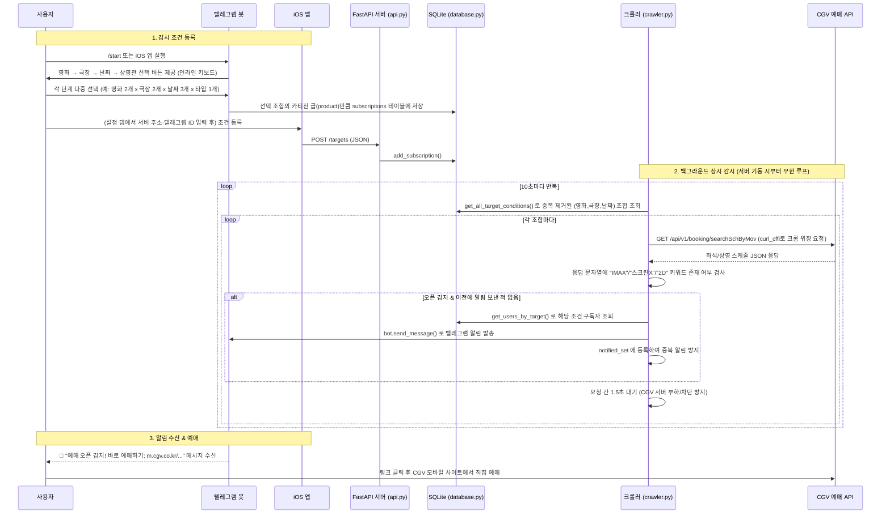

# 🎬 CGV Watcher

> CGV 특정 상영관(IMAX / ScreenX / 2D)의 좌석 예매 오픈을 실시간으로 감시하고,
> 예매가 열리는 즉시 **텔레그램 봇**과 **iOS 앱**으로 알려주는 개인용 예매 알리미 시스템


---

## 🔐 보안 관련 변경 사항 (필독)

이전 버전에는 텔레그램 봇 토큰이 `main.py`에 평문으로 하드코딩되어 있었고, 실제 RSA 개인키 파일(`ssh-key-2026-08-27.key`)이 저장소에 커밋되어 있었습니다. 이번 업데이트에서 다음과 같이 수정했습니다.

- ✅ 토큰은 더 이상 코드에 없습니다 — `config.py`가 `.env` 파일(또는 환경 변수)에서 읽어옵니다.
- ✅ `config.py`, `.env`, `*.key`, `*.pem`, `data/`(개인정보가 담긴 DB)를 `.gitignore`에 등록했습니다.
- ✅ iOS 앱의 서버 주소·텔레그램 ID도 코드 하드코딩 대신 앱 안의 **"설정" 탭**에서 입력하도록 변경했습니다.
- ⚠️ 다만 **이미 GitHub에 한 번이라도 올린 적이 있다면, 과거 커밋 히스토리에는 여전히 유출된 값이 남아있습니다.** 코드 수정과는 별개로 반드시 아래 두 가지를 먼저 하세요.
  1. [@BotFather](https://t.me/BotFather)에서 기존 토큰 **폐기(Revoke) 후 재발급**
  2. 해당 SSH 키가 등록된 서버에서 **authorized_keys 제거 및 키 교체**

상세한 히스토리 정리 절차는 함께 제공된 **`GITHUB_UPLOAD_GUIDE.md`** 문서를 참고하세요.

---

## 📋 목차

1. [프로젝트 심층 소개 (Overview)](#1-프로젝트-심층-소개-overview)
2. [사용 기술 및 라이브러리 (Tech Stack)](#2-사용-기술-및-라이브러리-tech-stack--dependencies)
3. [핵심 기능 및 상세 로직 (Key Features)](#3-핵심-기능-및-상세-로직-key-features--logic)
4. [프로젝트 구조 (Directory Structure)](#4-프로젝트-구조-및-파일-설명-directory-structure)
5. [🚀 Getting Started](#5--getting-started-설치-및-실행-가이드)
6. [🛠️ Troubleshooting & Dev Log](#6-️-troubleshooting--dev-log)

---

## 1. 프로젝트 심층 소개 (Overview)

### 1-1. 어떤 문제를 해결하는가

CGV의 인기 상영작(예: IMAX, ScreenX 특별관)은 상영 스케줄이 **예고 없이, 불규칙한 타이밍에** 오픈되는 경우가 많습니다. 사용자가 원하는 영화·극장·날짜·상영관 조합의 예매가 언제 열릴지 CGV 공식 앱/웹사이트를 수동으로 몇 분에 한 번씩 새로고침하며 확인하는 것은 비효율적이고 피로도가 높습니다.

**CGV Watcher**는 이 문제를 다음과 같이 해결합니다.

- 사용자는 **텔레그램 봇** 또는 **iOS 앱**을 통해 "어떤 영화 / 어떤 극장 / 어떤 날짜 / 어떤 상영관 타입"을 감시할지 등록만 해두면 됩니다.
- 서버(백엔드)는 등록된 모든 조건을 **10초 간격으로 자동 폴링**하며 CGV의 내부 예매 조회 API를 대신 확인합니다.
- 원하는 상영관 타입(IMAX/ScreenX/2D)의 좌석 스케줄이 **응답 데이터에 처음 나타나는 순간**(= 오픈 감지) 등록한 사용자에게 즉시 텔레그램 메시지로 알림을 보냅니다.
- 즉, 사람이 반복 새로고침하던 노동을 **백그라운드 크롤러 + 알림 봇**으로 완전히 대체하는 개인용 자동화 도구입니다.

### 1-2. 전체 아키텍처 흐름 (Architecture Flow — 시나리오)



**핵심 설계 포인트**

- **하나의 FastAPI 프로세스 안에서 3가지 역할(웹 API 서버 / 텔레그램 봇 폴링 / 크롤러)이 모두 asyncio 이벤트 루프 위에서 동시에 실행**됩니다. (`main.py`의 `lifespan` 컨텍스트 매니저가 이 셋을 부트스트랩합니다.)
- 사용자 접점은 **텔레그램 봇(주력)**과 **iOS 앱(보조)** 2가지이며, 둘 다 결국 같은 SQLite `subscriptions` 테이블에 조건을 저장하고, 같은 크롤러가 이를 감시합니다.
- CGV 자체는 이 프로젝트에 공식 API나 웹훅을 제공하지 않으므로, **일반 사용자가 브라우저에서 스케줄을 조회할 때 호출되는 내부(비공식) API를 그대로 재사용**하는 방식(리버스 엔지니어링 기반 폴링)입니다.

---

## 2. 사용 기술 및 라이브러리 (Tech Stack & Dependencies)

### 2-1. 백엔드 (Python)

| 구분 | 기술/라이브러리 | 역할 |
|---|---|---|
| 언어 |  | 실제 구동 버전 |
| 웹 프레임워크 |  | iOS 앱이 통신하는 REST API(`/targets`) 제공 |
| ASGI 서버 |  | FastAPI 앱을 8000번 포트에서 구동 |
| 데이터 검증 |  | `models.py`의 `TargetRequest` 스키마 정의 및 요청 바디 검증 |
| 비동기 HTTP 클라이언트 |  | 크롬 TLS 핑거프린트를 위장(`impersonate="chrome110"`)하여 CGV의 봇 차단을 우회 |
| 텔레그램 봇 SDK |  | 대화형 버튼(인라인 키보드) 기반 조건 등록 흐름 구현 |
| 환경 변수 관리 |  | `.env` 파일에서 토큰 등 시크릿을 읽어와 코드와 분리 |
| 데이터베이스 |  | 파일 기반 DB(`data/user_data.db`), 별도 서버 불필요 |
| 표준 라이브러리 | `asyncio`, `json`, `sqlite3`, `os`, `sys`, `itertools`, `contextlib`, `logging` | 비동기 루프, JSON 파싱, DB 커넥션, 로그 출력 등 |

### 2-2. 프론트엔드 (iOS)

| 구분 | 기술 | 역할 |
|---|---|---|
| 언어 |  | iOS 네이티브 앱 개발 언어 |
| UI 프레임워크 |  | 선언형 UI로 폼/리스트/설정 화면 구성 |
| 통신 | `URLSession` (Foundation) | `async/await` 기반으로 FastAPI 서버와 JSON 통신 |
| 로컬 저장소 | `UserDefaults` | 서버 주소·텔레그램 ID를 코드가 아닌 기기 안에 저장 (`AppSettings.swift`) |
| 아키텍처 패턴 | `ObservableObject` + `@StateObject` | `NetworkManager`를 뷰 간 공유 가능한 상태 객체로 관리 |

### 2-3. 외부 연동 API

| API | 용도 |
|---|---|
| **CGV 비공식 예매 조회 API**<br>`cgv.co.kr/api/v1/booking/searchSchByMov` | 특정 극장/영화/날짜의 상영 스케줄 및 좌석 오픈 여부를 조회 (공식 문서 없음) |
| **Telegram Bot API** | 사용자와의 대화형 인터페이스 및 오픈 감지 시 푸시 알림 발송 |

---

## 3. 핵심 기능 및 상세 로직 (Key Features & Logic)

### 3-1. 텔레그램을 통한 다중 선택 조건 등록 (`telegram_bot.py`)

- `OPTIONS` 딕셔너리에 영화/극장/날짜/상영관 타입의 코드-라벨 매핑을 정의합니다.
- `get_session(user_id)`는 `user_sessions`라는 **인메모리 딕셔너리**에 사용자별 진행 상태를 `set()`으로 저장해, **같은 카테고리 내 여러 항목을 중복 선택**할 수 있게 합니다.
- `build_keyboard()`는 선택된 항목에 `✅` 표시를 붙이고, 하나라도 선택되면 "다음 단계" 버튼을 노출합니다.
- 4단계 선택이 끝나면 `itertools.product()`로 **모든 선택 항목의 카티전 곱**을 만들어 한 번에 `database.add_subscription()`을 반복 호출합니다.
  - 예: 영화 2개 × 극장 1개 × 날짜 3개 × 타입 1개 → **총 6개의 감시 조건**이 저장됩니다.
- `user_sessions`는 메모리 변수이므로 서버 재시작 시 **완료되지 않은 진행 중 세션만** 초기화됩니다(이미 저장된 구독은 영향 없음).

### 3-2. 백그라운드 크롤러 & 오픈 감지 로직 (`crawler.py`)

1. `AsyncSession(impersonate="chrome110")`으로 세션을 열어, TLS/HTTP2 핑거프린트를 크롬 110 브라우저처럼 위장해 CGV의 봇 차단(TLS fingerprinting)을 회피합니다.
2. `while True` 루프에서 `get_all_target_conditions()`로 조건을 가져온 뒤 `(영화, 극장, 날짜)` 조합으로 **중복 제거** — 여러 사용자가 상영관 타입만 다르게 등록해도 **CGV API 호출은 조합당 1번만** 발생합니다.
3. 응답 JSON을 대문자 문자열로 정규화한 뒤, `"IMAX"`, `"스크린X"`, `"2D"` 등의 부분 문자열 포함 여부로 오픈을 판단합니다.
4. `notified_set`(인메모리 집합)으로 이미 알림을 보낸 조합은 재알림하지 않도록 방지합니다.
5. 오픈 감지 시 `get_users_by_target()`로 구독자를 플랫폼별로 조회해, 텔레그램 사용자에게는 즉시 메시지를 발송합니다. (iOS 푸시는 아직 로그만 남기는 미구현 상태)
6. 요청 사이 1.5초, 전체 사이클 사이 10초의 지연으로 CGV 서버 부하를 조절합니다.
7. **[이번 수정]** 기존에는 개별 API 요청 실패 시 `except Exception: pass`로 오류를 완전히 무시했지만, 이제는 `logging.warning()`으로 **어떤 조합에서 어떤 이유로 실패했는지 로그에 남깁니다.**
8. `asyncio.CancelledError`를 처리해, 서버 종료 시 크롤러가 예외 로그 없이 깔끔히 종료됩니다.

### 3-3. REST API (`api.py`, `models.py`) — iOS 클라이언트 연동

- `TargetRequest`(Pydantic `BaseModel`)로 요청 바디의 타입과 필수값을 강제, 잘못된 요청은 자동으로 422 에러 반환.
- `GET /targets` : 크롤러가 실제로 감시 중인 전체 조건 확인 (디버깅용).
- `GET /targets/{user_id}` : 특정 사용자의 구독 목록 조회 (iOS "감시 목록" 탭).
- `POST /targets` : 새 조건 등록 (`platform`을 `"ios"`로 고정 저장).
- `DELETE /targets` : 조건 삭제 (HTTP DELETE에 바디를 함께 전송).

### 3-4. 데이터베이스 계층 (`database.py`)

- 별도 DB 서버 없이 **SQLite 단일 파일**(`data/user_data.db`)로 동작.
- `UNIQUE(user_id, movie_code, theater_code, target_date, screen_type)` 제약으로 `INSERT OR IGNORE` 한 줄에서 **중복 등록을 DB 레벨에서 자동 방지**.
- 호출마다 커넥션을 열고 닫는 **connection-per-call** 패턴 — 개인용 프로젝트 규모에는 충분히 합리적.

### 3-5. iOS 앱

- **탭 3개 구조**(`MainTabView`): "조건 등록"(`ContentView`) / "감시 목록"(`TargetListView`) / **"설정"(`SettingsView`, 이번에 추가)**.
- `ContentView`는 `Form` + `Picker` + 한국어 로케일(`ko_KR`) `DatePicker`로 조건을 입력받고, `formattedTargetDate`로 서버가 요구하는 `"yyyyMMdd"` 문자열로 변환합니다. `AppSettings.isConfigured`가 `false`면 등록 버튼이 비활성화되고 경고 문구가 표시됩니다.
- `TargetListView`는 스와이프 삭제(`.onDelete`)와 당겨서 새로고침(`.refreshable`)을 지원하며, 서버 삭제 성공 시에만 로컬 목록에서도 제거합니다.
- **[이번 수정] `AppSettings.swift`**: 서버 주소와 텔레그램 ID를 코드가 아닌 `UserDefaults`에 저장/조회하는 헬퍼. `isConfigured`로 두 값이 모두 채워졌는지 확인합니다.
- **[이번 수정] `SettingsView.swift`**: 서버 주소·텔레그램 ID를 입력하는 새 화면. 저장 시 `UserDefaults`에 기록됩니다.
- **[이번 수정] `NetworkManager.swift`**: `baseURL`이 더 이상 고정 문자열이 아니라 `AppSettings.baseURL`을 읽어오는 계산 프로퍼티로 변경. 값이 비어 있으면 API 호출 전에 사용자에게 안내 메시지를 반환합니다.

---

## 4. 프로젝트 구조 및 파일 설명 (Directory Structure)

```text
cgv_watcher-main/
├── main.py                    # 🚀 진입점. FastAPI 앱 생성 + lifespan으로 DB/텔레그램봇/크롤러 동시 기동. [수정] 토큰을 config에서 import, logging 설정 추가
├── api.py                     # 🌐 iOS용 REST API 라우터 (/targets GET·POST·DELETE) — 변경 없음
├── models.py                  # 📦 Pydantic 요청 스키마 (TargetRequest) — 변경 없음
├── database.py                # 💾 SQLite 연결·초기화·CRUD 함수 모음 — 변경 없음
├── crawler.py                 # 🔍 CGV 예매 API 폴링·오픈 감지. [수정] 예외를 무시하지 않고 logging으로 기록
├── telegram_bot.py            # 🤖 텔레그램 인라인 키보드 기반 다단계 조건 등록 — 변경 없음
├── config.py                  # ⚙️ [수정] .env/환경 변수에서 TELEGRAM_TOKEN을 읽어오도록 변경 (git 추적 제외)
├── .env.example                # 🆕 [신규] .env 템플릿 파일 (안전하게 커밋 가능, 실제 값은 없음)
├── requirements.txt            # 📋 [수정] fastapi, uvicorn, pydantic, curl_cffi, python-telegram-bot, python-dotenv 명시
├── .gitignore                  # 🚫 [수정] config.py, .env, *.key, *.pem, data/ 를 git 추적에서 제외
├── GITHUB_UPLOAD_GUIDE.md      # 🆕 [신규] 히스토리에서 시크릿을 지우고 안전하게 push하는 절차 안내
│
├── CGVWatcherApp.swift         # 📱 iOS 앱의 @main 진입점 — 변경 없음
├── MainTabView.swift            # 📱 [수정] "설정" 탭 추가 (총 3개 탭)
├── ContentView.swift            # 📱 [수정] 하드코딩된 userId 제거, AppSettings 사용 + 미설정 시 경고 표시
├── TargetListView.swift         # 📱 [수정] 하드코딩된 userId 제거, AppSettings 사용
├── Models.swift                 # 📱 서버 통신용 Codable 모델 + 공용 코드-라벨 매핑 — 변경 없음
├── NetworkManager.swift         # 📱 [수정] baseURL 하드코딩 제거, AppSettings.baseURL 사용
├── AppSettings.swift             # 🆕 [신규] 서버 주소·텔레그램 ID를 UserDefaults로 관리하는 헬퍼
├── SettingsView.swift            # 🆕 [신규] 서버 주소·텔레그램 ID를 입력하는 설정 화면
│
└── README.md                    # 📖 프로젝트 설명 문서 (본 파일)
```

> 💡 `ssh-key-2026-08-27.key` 파일은 프로젝트와 무관한 서버 접속용 키이므로 **완전히 삭제**하고 목록에서도 제외했습니다. `data/` 디렉터리는 서버 최초 실행 시 자동 생성됩니다.

---

## 5. 🚀 Getting Started (설치 및 실행 가이드)

### 5-1. 사전 준비물

- Python **3.11 이상** (개발/확인 환경: 3.13)
- 텔레그램 봇 토큰 ([@BotFather](https://t.me/BotFather)에서 **새로** 발급 — 기존 노출 토큰은 0단계에서 반드시 폐기)
- (iOS 앱을 함께 쓸 경우) Xcode 최신 버전

### 5-2. 백엔드 설치

```bash
cd cgv_watcher-main

# 가상환경 생성 및 활성화 (권장)
python3 -m venv venv
source venv/bin/activate        # Windows: venv\Scripts\activate

# 의존성 설치
pip install -r requirements.txt
```

### 5-3. 환경 변수 설정 (필수)

```bash
cp .env.example .env
```

`.env` 파일을 열어 아래처럼 채워 넣습니다.

```env
TELEGRAM_BOT_TOKEN=여기에_새로_발급받은_봇_토큰을_입력하세요
```

`config.py`는 이 `.env` 파일을 자동으로 읽어와 `TELEGRAM_TOKEN`을 채워줍니다. `.env`를 만들지 않고 실행하면 아래와 같은 명확한 에러 메시지가 뜨며 실행이 중단됩니다.

```text
RuntimeError: TELEGRAM_BOT_TOKEN이 설정되지 않았습니다. ...
```

### 5-4. 서버 실행

```bash
python main.py
```

정상 기동 로그:

```text
✅ 데이터베이스 스키마(구조) 업그레이드 완료!
🚀 시스템 가동 시작!
🤖 텔레그램 봇 폴링 시작.
🔍 [크롤러] 모듈화된 백그라운드 감시 시작!
```

- API 서버: `http://0.0.0.0:8000`
- Swagger 문서: `http://localhost:8000/docs`
- 텔레그램: 봇과의 채팅창에서 `/start` 입력 시 조건 등록 위저드 시작

### 5-5. iOS 앱 실행

1. Xcode에서 `.swift` 파일들을 프로젝트에 추가합니다 (`AppSettings.swift`, `SettingsView.swift` 포함 — 누락하면 빌드 에러 발생).
2. 시뮬레이터/기기에서 앱을 빌드·실행합니다.
3. **앱 실행 후 가장 먼저 하단의 "설정" 탭으로 이동**하여:
   - 서버 주소 (예: `http://123.45.67.89:8000` 또는 로컬 테스트 시 `http://localhost:8000`)
   - 본인의 텔레그램 ID ([@userinfobot](https://t.me/userinfobot)으로 확인 가능)
   를 입력하고 저장합니다.
4. 이제 "조건 등록" / "감시 목록" 탭이 정상적으로 서버와 통신합니다.

> ℹ️ HTTP(비HTTPS)로 원격 서버와 통신하려면 `Info.plist`에 App Transport Security(ATS) 예외 설정이 필요할 수 있습니다.

### 5-6. GitHub에 올리기

코드를 수정했다면 이제 GitHub에 반영할 차례입니다. **이미 과거에 시크릿이 커밋된 적이 있는 저장소인지에 따라 절차가 다르므로**, 함께 제공된 **`GITHUB_UPLOAD_GUIDE.md`** 문서를 순서대로 따라주세요. (히스토리 정리, force-push, 협업자 안내까지 포함되어 있습니다.)

---

## 6. 🛠️ Troubleshooting & Dev Log

### 🔴 [해결됨] 시크릿 하드코딩 & 개인키 커밋 사고

- **증상**: `main.py`에 텔레그램 봇 토큰이 평문으로 존재, `ssh-key-2026-08-27.key`가 저장소에 실제로 커밋됨.
- **원인 추정**: 초기 프로토타이핑 단계에서 빠른 개발을 위해 토큰을 코드에 직접 넣고, 서버 접속용 키 파일을 프로젝트 폴더 안에 두었다가 `git add .`로 함께 커밋된 것으로 보입니다. 이후 `.gitignore`에 항목을 추가했지만, **이미 추적 중이던 파일은 `.gitignore`만으로 추적 해제되지 않는다**는 점을 놓친 것으로 보입니다.
- **적용한 수정**:
  - `config.py`가 `python-dotenv`로 `.env` 파일을 읽어 `TELEGRAM_TOKEN`을 제공하도록 변경, `main.py`는 `from config import TELEGRAM_TOKEN`으로 가져다 씀.
  - `.env`, `config.py`, `*.key`, `*.pem`을 `.gitignore`에 추가.
  - `ssh-key-2026-08-27.key` 파일 자체는 프로젝트에서 완전히 제거.
- **사용자가 추가로 해야 할 일**: BotFather에서 토큰 폐기·재발급, 키가 등록된 서버에서 authorized_keys 정리, 그리고(이미 push한 적이 있다면) `GITHUB_UPLOAD_GUIDE.md`의 히스토리 정리 절차 수행.

### 🟠 CGV의 봇 차단(Anti-bot) 우회

- **증상**: 일반 HTTP 클라이언트로 CGV API를 호출하면 TLS 핸드셰이크 단계에서 비정상 트래픽으로 분류되어 차단될 가능성.
- **해결 방법**: `curl_cffi`의 `AsyncSession(impersonate="chrome110")`으로 TLS/JA3 핑거프린트를 크롬 110처럼 위장하고, `Referer: https://m.cgv.co.kr/` 헤더까지 명시. 요청 사이 1.5초, 사이클 사이 10초 지연으로 과도한 요청(IP 차단 위험)도 예방.

### 🟡 asyncio 기반 3중 백그라운드 태스크 동시 구동

- **증상**: FastAPI(웹 서버) + python-telegram-bot(폴링) + 커스텀 크롤러(무한 루프)를 한 프로세스 안에서 충돌 없이 구동해야 함.
- **해결 방법**: `lifespan` 컨텍스트 매니저에서 텔레그램 봇을 먼저 `initialize → start → start_polling` 순으로 부트스트랩한 뒤, 크롤러는 `asyncio.create_task()`로 별도 태스크로 스케줄링해 메인 이벤트 루프를 막지 않도록 설계. 종료 시 크롤러 `cancel()` → 봇 `stop()`/`shutdown()` 순으로 역순 정리.
- **[이번 수정] 남아있던 이슈 일부 해결**: `crawler.py`의 `except Exception: pass`를 `logging.warning()`으로 교체해, 어떤 조합에서 API 요청이 왜 실패했는지 이제 로그로 확인할 수 있습니다.

### 🟡 중복 알림 방지 (같은 오픈을 여러 번 알리지 않기)

- **증상**: 폴링 방식이므로 한 번 오픈되면 계속 "열려 있음"으로 감지되어 알림이 반복 발송될 위험.
- **해결 방법**: `notified_set`(인메모리 집합)에 이미 알린 조합을 저장해 재확인을 건너뜀.
- **알려진 한계 (이번 릴리즈에서는 미해결)**: `notified_set`이 프로세스 메모리에만 존재해 **서버 재시작 시 초기화**됩니다. 향후 개선 아이디어로는 `subscriptions` 테이블에 `notified` 플래그 컬럼을 추가해 영속화하는 방법이 있습니다.

### 🟡 다중 플랫폼(텔레그램/iOS) 구독자 통합 관리

- **증상**: 텔레그램·iOS 사용자가 같은 테이블을 공유하지만 알림 방식이 다름.
- **해결 방법**: `platform` 컬럼으로 구분 저장, `get_users_by_target()`이 `{'telegram': [...], 'ios': [...]}`로 미리 분류해 반환.
- **현재 상태**: iOS 푸시(APNs)는 아직 미구현 — `crawler.py`에서 TODO 로그만 출력. 실제 구현 시 디바이스 토큰 등록 API와 APNs(또는 FCM) 연동이 추가로 필요합니다.

### 🟢 [해결됨] iOS 앱에 하드코딩된 서버 주소·사용자 ID

- **증상**: `NetworkManager.swift`의 `baseURL`과 `ContentView.swift`/`TargetListView.swift`의 `userId`가 실제 서버 IP·더미 텔레그램 ID로 소스코드에 박혀 있었음. 다른 사람이 같은 코드를 그대로 빌드하면 원래 개발자의 서버로 요청을 보내게 되는 문제.
- **해결 방법**: `AppSettings.swift`(UserDefaults 래퍼)와 새 `SettingsView.swift` 화면을 추가해, 서버 주소와 텔레그램 ID를 **앱 실행 후 사용자가 직접 입력**하도록 변경. 값이 없으면 등록/목록 화면에서 안내 문구를 보여주고 동작을 막습니다.

### ⚪ [해결됨] 빈 `requirements.txt` / `config.py`

- **증상**: 두 파일 모두 0바이트로 커밋되어 있었음.
- **해결 방법**: `requirements.txt`에 실제 사용 중인 패키지(fastapi, uvicorn, pydantic, curl_cffi, python-telegram-bot, python-dotenv)를 명시. `config.py`는 `.env` 로더 역할을 하도록 내용을 채움.

---

<div align="center">

**Made for movie lovers who refuse to keep refreshing the CGV app.** 🍿

</div>
